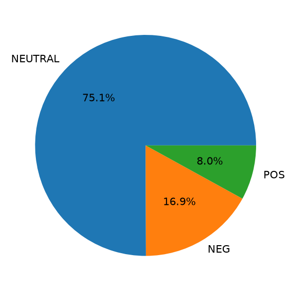
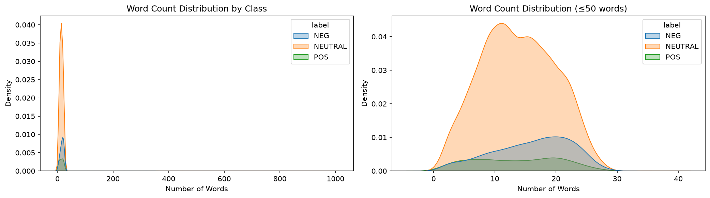
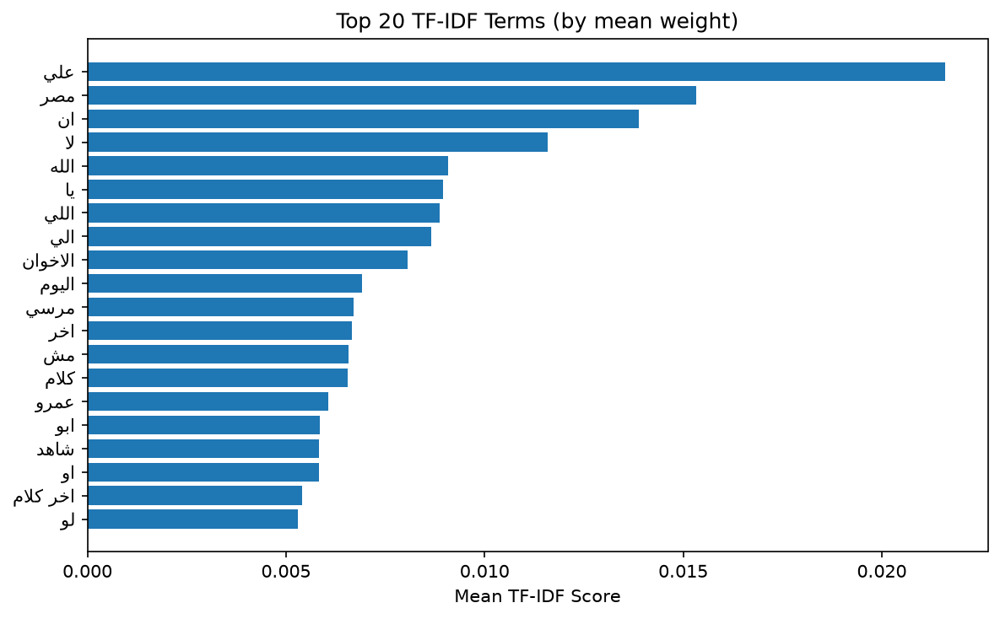
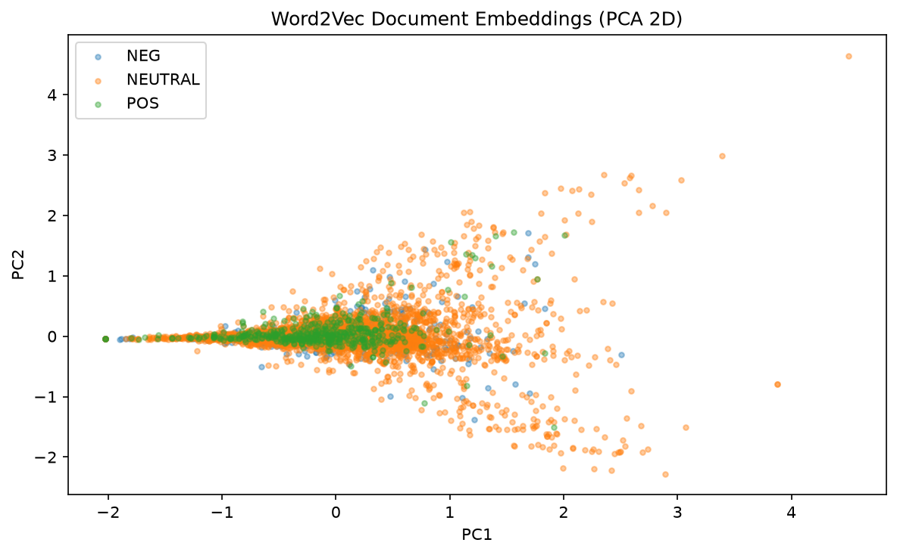
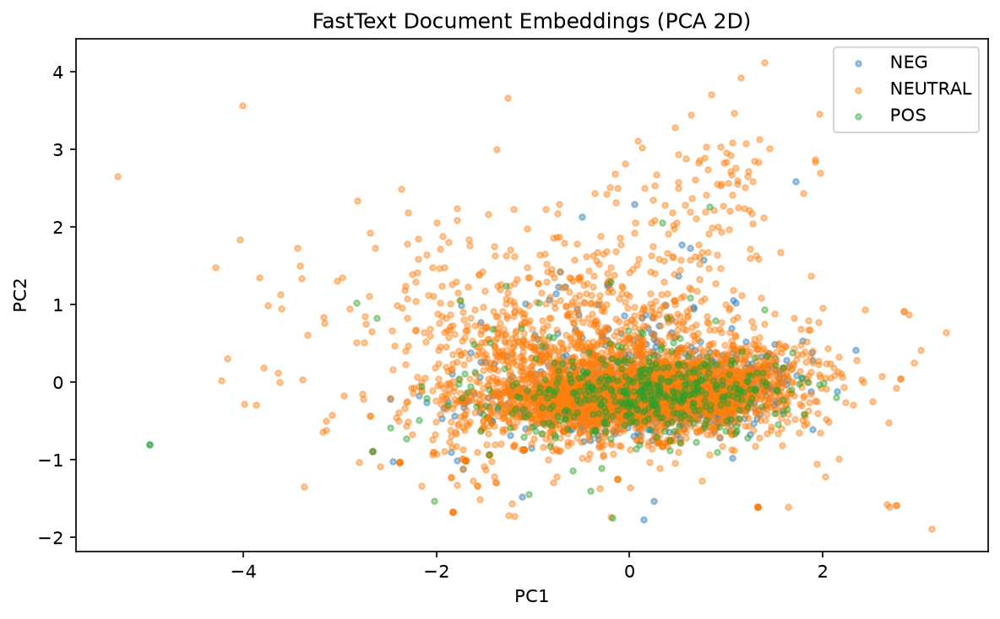
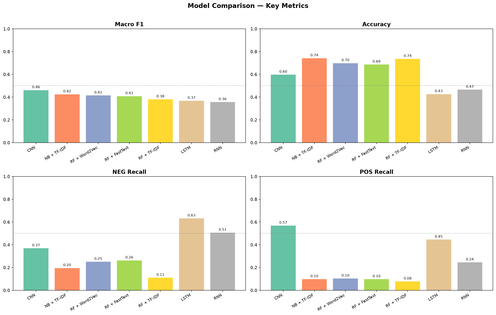
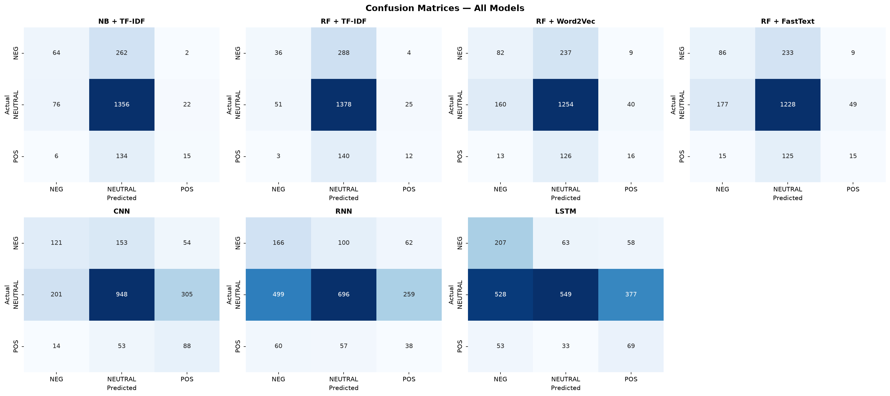
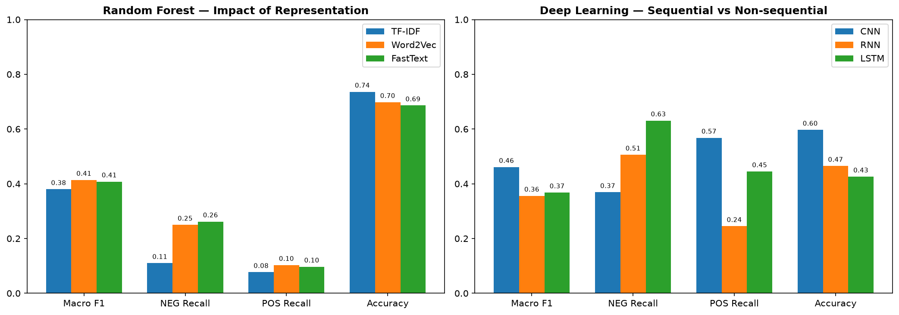

# Arabic Sentiment Analysis
**Birzeit University — Department of Electrical and Computer Engineering**
**Second Semester 2025-2026 | Second Assignment**

---

# Problem Overview

The goal of this project is to classify Arabic tweets as Positive, Negative, or Neutral. The dataset used is the ASTD corpus — Arabic tweets that were originally labelled as POS, NEG, OBJ, or NEUTRAL. We merged OBJ into NEUTRAL since they essentially mean the same thing here, giving us three final classes: **NEG**, **NEUTRAL**, **POS**.

We compared multiple text representation methods (TF-IDF, Word2Vec, FastText) paired with multiple classifiers (Naïve Bayes, Random Forest, CNN, RNN, LSTM) to see which combinations work best for Arabic sentiment.

---

# 1. Dataset

The dataset has 9,694 tweets. The class distribution is heavily skewed — 75% of the data is NEUTRAL, leaving only 17% NEG and 8% POS.

| Class | Count | % |
|---|---|---|
| NEUTRAL | ~7,274 | 75% |
| NEG | ~1,641 | 17% |
| POS | ~769 | 8% |

This imbalance is the central challenge of the assignment. A model that always predicts NEUTRAL would score 75% accuracy while being completely useless — so accuracy alone is a misleading metric here. All our decisions around evaluation and class handling were driven by this.

As we can see from the KDE plot, word count does not vary much between classes — for the most part all are right skewed and most tweets are short. So there is no true information gain from the length.

---

# 2. Data Preprocessing

Arabic social media text requires specific cleaning steps before feeding it to any model:

| Step | What was done |
|---|---|
| Noise removal | Removed URLs, HTML tags, @mentions; stripped `#` but kept the hashtag word |
| Tashkeel | Removed short vowel diacritics — rarely appear on social media and inflate vocab |
| Tatweel | Removed the elongation character ـ |
| Alef normalisation | Mapped أ / إ / آ → ا |
| Yeh normalisation | Mapped ى → ي |
| Teh Marbuta | Mapped ة → ه |
| Waw/Yeh hamza | Mapped ؤ → و and ئ → ي |
| Non-Arabic removal | Kept only Arabic Unicode range (U+0600–U+06FF) |
| Stop words | Removed ~80 common function words with no sentiment value |
| Short tokens | Dropped single-character tokens |

Negation words (لا، لم، ليس) were intentionally kept — removing them flips sentiment entirely (e.g. "لا أحب" → "أحب" changes "I don't like" to "I like").

Emojis were removed entirely. Although emojis do provide sentiment, converting them to Arabic translations would overcomplicate the pipeline too much. We recommend keeping it strictly words to keep things manageable.

After preprocessing, 10 tweets became empty and were dropped, leaving **9,684 samples**.

---

# 3. Dataset Splitting

We used a stratified 60/20/20 split so each set has the same class proportions as the full dataset.

| Split | Samples | NEG | NEUTRAL | POS |
|---|---|---|---|---|
| Train | 5,810 | 17.0% | 75.0% | 8.0% |
| Validation | 1,937 | 16.9% | 75.1% | 8.0% |
| Test | 1,937 | 16.9% | 75.1% | 8.0% |

All vectorisers and tokenisers were fit on training data only — never on validation or test.

---

# 4. Feature Representations

## 4.1 TF-IDF

TF-IDF converts each tweet into a sparse vector of weighted word and bigram scores. If a term appears a lot in one document but is rare across all documents, it receives a higher score — in essence, it captures what makes each tweet distinctive.

**Parameters:** `max_features=10000`, `ngram_range=(1,2)`, `min_df=2`, `sublinear_tf=True`

Bigrams were included to capture negation phrases like "لا يحب". Sublinear TF dampens repeated terms so one word can't dominate.

**Compatible models:** ✓ Naïve Bayes (requires non-negative values — TF-IDF always ≥ 0), ✓ Random Forest. ✗ CNN / RNN / LSTM (these expect integer token sequences, not pre-computed vectors).

**Pros:**
- No training required — fit is instant
- Bigrams capture short negation phrases that unigrams miss
- Fully interpretable — feature weights map directly to words

**Cons:**
- No semantic understanding — synonyms like "جيد" and "ممتاز" are treated as unrelated tokens
- Arabic morphology inflates vocabulary — different surface forms of the same root count as separate features

## 4.2 Word2Vec (CBOW)

Word2Vec trains a shallow neural network to predict each word from its surrounding context, placing semantically similar words close together in vector space. Each tweet is then represented as the mean of its word vectors. In essence, we convert words to vectors and rely on semantic proximity for classification.

**Parameters:** `vector_size=100`, `window=2`, `min_count=2`, `sg=0` (CBOW), `epochs=15`

The heavy class overlap in the PCA projection shows the embeddings did not learn strong sentiment structure — expected given the small corpus size (~5,800 training tweets).

**Compatible models:** ✓ Random Forest (accepts dense real-valued vectors including negatives). ✗ Naïve Bayes (vectors contain negative values). ✗ CNN / RNN / LSTM (learn their own embeddings internally).

**Pros:**
- Semantically meaningful — similar words cluster together, so synonyms share representation
- Fixed-size output regardless of tweet length

**Cons:**
- Needs large corpora for quality embeddings; ~5,800 tweets is too small
- Mean pooling destroys word order entirely
- Cannot handle out-of-vocabulary words (no subword fallback)

## 4.3 FastText

FastText extends Word2Vec by decomposing each word into character n-grams and summing their vectors, so it can construct a meaningful embedding even for words never seen during training. In essence, we look at a sub-word level which helps with Arabic since the same word may have many spelling variations across dialects.

**Parameters:** `vector_size=300`, `window=2`, `min_count=2`, `epochs=20`

Similar class overlap to Word2Vec — the corpus is too small for either embedding method to fully shine from scratch.

**Compatible models:** ✓ Random Forest. ✗ Naïve Bayes (negative values). ✗ CNN / RNN / LSTM (learn their own embeddings internally).

**Pros:**
- Handles out-of-vocabulary words via subword n-grams — a major advantage for dialectal Arabic
- More robust to spelling variation than Word2Vec

**Cons:**
- Mean pooling still loses word order
- Negative values make it incompatible with Naïve Bayes
- Slower to train than Word2Vec due to character n-gram computation

---

# 5. Traditional Machine Learning Models

## 5.1 Naïve Bayes

MultinomialNB with Laplace smoothing, tuned via 3-fold GridSearchCV on `alpha` ∈ {0.01, 0.1, 0.5, 1.0, 2.0}.

**Best alpha: 0.1** — Only compatible with TF-IDF since Naïve Bayes cannot handle negative values.

| | Precision | Recall | F1 |
|---|---|---|---|
| NEG | 0.44 | 0.20 | 0.27 |
| NEUTRAL | 0.77 | 0.93 | 0.85 |
| POS | 0.38 | 0.10 | 0.15 |
| **Macro avg** | **0.53** | **0.41** | **0.42** |
| Accuracy | | | 0.74 |

Notice that the weighted average is much better than the macro average — this tells us the model is performing well on NEUTRAL but struggling to actually distinguish the minority classes.

## 5.2 Random Forest

Tuned via 3-fold GridSearchCV on `n_estimators` ∈ {100, 200, 300}, `max_depth` ∈ {None, 30}, `class_weight` ∈ {'balanced', None}.

### RF + TF-IDF — Best: `n_estimators=100, max_depth=None, class_weight=None`

| Macro F1 | NEG Recall | POS Recall | Accuracy |
|---|---|---|---|
| 0.38 | 0.11 | 0.08 | 0.74 |

### RF + Word2Vec — Best: `n_estimators=300, max_depth=30, class_weight=balanced`

| Macro F1 | NEG Recall | POS Recall | Accuracy |
|---|---|---|---|
| 0.41 | 0.25 | 0.10 | 0.70 |

### RF + FastText — Best: `n_estimators=200, max_depth=None, class_weight=balanced`

| Macro F1 | NEG Recall | POS Recall | Accuracy |
|---|---|---|---|
| 0.41 | 0.26 | 0.10 | 0.69 |

Notice that `class_weight=balanced` won for both dense embedding variants but not for TF-IDF. With TF-IDF's 10,000-feature sparse space, RF had enough signal to work without rebalancing — forcing balanced weights actually hurt by over-predicting minority classes with poor precision. With dense embeddings the signal is weaker, so the explicit rebalancing was necessary to push recall above near-zero.

---

# 6. Deep Learning Models

All three DL models follow the same input pipeline: words are tokenised to integer indices (vocabulary of 10,000), padded/truncated to 50 tokens, then fed into an embedding layer that learns a dense vector per token during training.

**Shared settings:** `MAX_SEQ_LEN=50`, `BATCH_SIZE=64`, `MAX_EPOCHS=30`, `PATIENCE=5` (early stopping with `restore_best_weights=True`)

**Class weights** (inverse-frequency): NEG=1.97, NEUTRAL=0.44, POS=4.16 — penalises the model more for missing minority classes during training.

Hyperparameters were searched manually over a small grid, selecting the best configuration by validation F1.

## 6.1 CNN

Architecture: `Embedding(10000, 100) → Conv1D(filters, kernel) → GlobalMaxPool → Dropout → Dense(3)`

The Conv1D layer slides filters across the sequence to detect local n-gram patterns — it keeps the strongest signal from each filter regardless of position. This is what makes CNN effective for short texts.

Tuned over: `filters` ∈ {64, 128}, `kernel_size` ∈ {3, 5}, `dropout` ∈ {0.3, 0.5}

| filters | kernel | dropout | Val F1 |
|---|---|---|---|
| 64 | 3 | 0.3 | 0.644 |
| **128** | **3** | **0.5** | **0.654** ← best |
| 128 | 5 | 0.5 | 0.270 |

The larger kernel (5) collapsed performance entirely — spanning too many tokens for typical Arabic tweet patterns lost the local n-gram signal. Higher dropout (0.5) helped regularise the larger filter count.

**Best: filters=128, kernel=3, dropout=0.5** — Test macro F1: **0.46**, POS recall: **0.57**, Accuracy: 0.60

## 6.2 RNN

Architecture: `Embedding(10000, 100) → SimpleRNN(hidden, unroll=True) → Dropout → Dense(3)`

`unroll=True` was used to parallelise the time loop and enable GPU acceleration on Apple Silicon via Metal.

Tuned over: `hidden_units` ∈ {64, 128}, `dropout` ∈ {0.3, 0.5}

| hidden | dropout | Val F1 |
|---|---|---|
| **64** | **0.3** | **0.524** ← best |
| 128 | 0.3 | 0.401 |
| 128 | 0.5 | 0.275 |

More hidden units actually hurt RNN — larger hidden states made the vanishing gradient problem worse, causing the model to lose sentiment signal earlier in training. The smallest config generalised best.

**Best: hidden=64, dropout=0.3** — Test macro F1: **0.36**, NEG recall: 0.51, Accuracy: 0.46

## 6.3 LSTM

Architecture: `Embedding(10000, 100) → LSTM(hidden) → Dropout → Dense(3)`

LSTM adds forget/input/output gates over the plain RNN, allowing it to control what to remember or discard across the sequence.

Tuned over: `hidden_units` ∈ {64, 128}, `dropout` ∈ {0.3, 0.5}

| hidden | dropout | Val F1 |
|---|---|---|
| 64 | 0.3 | 0.396 |
| 128 | 0.3 | 0.463 |
| **128** | **0.5** | **0.488** ← best |

LSTM showed the opposite trend from RNN — larger hidden units helped because the gating mechanism lets the model manage larger states without the same vanishing gradient problem. Higher dropout (0.5) prevented overfitting at the larger capacity.

**Best: hidden=128, dropout=0.5** — Test macro F1: **0.37**, NEG recall: **0.63**, Accuracy: 0.43

---

# 7. Comparative Evaluation

## Full Results Table

| Model | Accuracy | Macro F1 | Weighted F1 | NEG Prec | NEG Rec | POS Prec | POS Rec |
|---|---|---|---|---|---|---|---|
| **CNN** | 0.597 | **0.461** | 0.631 | 0.360 | 0.369 | 0.197 | **0.568** |
| NB + TF-IDF | **0.741** | 0.424 | **0.693** | **0.438** | 0.195 | **0.385** | 0.097 |
| RF + Word2Vec | 0.698 | 0.414 | 0.672 | 0.322 | 0.250 | 0.246 | 0.103 |
| RF + FastText | 0.686 | 0.408 | 0.665 | 0.309 | 0.262 | 0.205 | 0.097 |
| RF + TF-IDF | 0.736 | 0.380 | 0.674 | 0.400 | 0.110 | 0.293 | 0.077 |
| LSTM | 0.426 | 0.368 | 0.472 | 0.263 | **0.631** | 0.137 | 0.445 |
| RNN | 0.465 | 0.356 | 0.518 | 0.229 | 0.506 | 0.106 | 0.245 |

> Accuracy is misleading here — a model that always predicts NEUTRAL would score 75%. Macro F1 and minority-class recall/precision are the true performance indicators.

## Impact of Representation (RF comparison)

When holding the classifier constant (Random Forest), dense embeddings come out ahead of TF-IDF on minority-class recall. RF + TF-IDF almost never predicts NEG or POS (recall: 0.11 / 0.08), while RF + Word2Vec and RF + FastText push that up to 0.25–0.26. The overall macro F1 gap is small, but the confusion matrices tell the real story — TF-IDF-based RF is nearly always defaulting to NEUTRAL.

## Sequential vs Non-sequential DL

CNN outperforms both RNN and LSTM on macro F1 (0.46 vs 0.37 and 0.36). For short tweets (≤50 tokens), detecting local word patterns in parallel is more effective than processing the sequence step by step. LSTM leads on NEG recall (0.63) due to its gating mechanism, but that comes at the cost of accuracy (0.43).

## Hyperparameter Tuning Influence

**Traditional ML:**
- NB: The default alpha=1.0 applies heavy smoothing that dilutes distinctive words. Tuning to alpha=0.1 let sentiment-specific terms carry more weight.
- RF + TF-IDF: `class_weight=balanced` actually hurt here — the 10,000-feature sparse space already gave RF enough signal. Forcing balanced weights over-predicted minority classes with poor precision.
- RF + Word2Vec / FastText: `class_weight=balanced` was necessary for both — without it, RF would barely predict minority classes at all.

**Deep Learning:**
- CNN: Kernel size had the biggest impact. Jumping from kernel=3 to kernel=5 dropped val F1 from 0.654 to 0.270 — too wide a window for short tweet patterns.
- RNN: More hidden units hurt (64 → 128 dropped val F1 from 0.524 to 0.401). Larger hidden states amplified the vanishing gradient problem.
- LSTM: More hidden units helped (64 → 128 improved val F1 from 0.396 to 0.463+). The gating mechanism handles larger capacity better than plain RNN.

## Strengths and Limitations Per Combination

| Combination | Macro F1 | Strength | Limitation |
|---|---|---|---|
| **NB + TF-IDF** | 0.42 | Highest precision on both minority classes (NEG: 0.44, POS: 0.38) — when it predicts NEG or POS it is usually right. Best accuracy (0.74). | Misses 80%+ of actual NEG and POS tweets (recall: 0.20 / 0.10). Effectively biased toward NEUTRAL. |
| **RF + TF-IDF** | 0.38 | Matches NB accuracy (0.74). Decent NEG precision (0.40). | Nearly never predicts sentiment — NEG recall 0.11, POS recall 0.08. Worst minority-class coverage of all models. |
| **RF + Word2Vec** | 0.41 | Balanced weights + dense embeddings pushed NEG recall to 0.25. Semantically similar words share representation. | Small corpus produced noisy embeddings. Mean pooling loses word order. POS recall still very low (0.10). |
| **RF + FastText** | 0.41 | Best NEG recall among RF variants (0.26) — subword n-grams handle Arabic spelling variants that Word2Vec would miss. | POS recall remains low (0.10). Slower to train than Word2Vec. |
| **CNN** | 0.46 | Best macro F1 overall. Best POS recall (0.57). Local pattern detection avoids vanishing gradient issues entirely. | Lower accuracy than ML models (0.60 vs 0.74). Very sensitive to kernel size — kernel=5 collapsed val F1 to 0.27. |
| **RNN** | 0.36 | Solid NEG recall (0.51) for the simplest sequential architecture. Lightest model to train. | Worst macro F1 among DL models. Larger hidden states actively hurt performance due to vanishing gradients. |
| **LSTM** | 0.37 | Best NEG recall of all 7 models (0.63). Good POS recall (0.45). Gating mechanism retains sentiment signals across the sequence. | Lowest accuracy (0.43). Aggressive minority-class detection comes at the cost of precision balance. |

---

# 8. Analysis and Conclusions

**1. Which representation performed best and why?**

It depends on how you look at it. Overall, TF-IDF wins — NB + TF-IDF had the best macro F1 (0.42). But that is partly a compatibility advantage, not purely a representation one. Word2Vec and FastText cannot be used with Naïve Bayes due to their negative values, so they never competed on equal terms. When you hold the classifier constant and compare all three using Random Forest, dense embeddings actually come out ahead — Word2Vec (0.41) and FastText (0.41) vs TF-IDF (0.38). The gap wasn't bigger because ~5,800 training tweets is too small for embeddings trained from scratch to fully shine.

---

**2. Traditional ML vs Deep Learning — which won and why?**

Traditional ML (NB + TF-IDF) achieved the best macro F1 (0.42), but that is only due to its successful predictions of the neutral classes and not the extremes (positives and negatives). The deep learning models focused more on actually being able to detect the minor classes, which makes them take a hit in total accuracy and F1, but in terms of recall and precision the deep learning have proven to be better here. In conclusion it depends on the domain we want to use our models in, if you want to be generalized and not be able to truly distinguish the minor classes then we go with traditional, but if being able to distinguish is your end goal even if it tanks your accuracy then deep learning wins.

---

**3. Sequential (RNN/LSTM) vs non-sequential (CNN) — what did we find?**

CNN outperformed both RNN and LSTM on macro F1 (0.46 vs 0.37 and 0.36). For short tweets (≤50 tokens), CNN's ability to detect local word patterns in parallel is more effective than processing the sequence step by step. RNN and LSTM suffer from vanishing gradients and struggle to carry sentiment signals across the full sequence, making them less effective here despite being architecturally more expressive.

---

**4. Impact of class imbalance — how did we handle it?**

The dataset is heavily skewed — 75% of tweets are NEUTRAL, leaving only 17% NEG and 8% POS. Without correction, any model would just predict NEUTRAL for almost everything and still score 75% accuracy. We handled this with two techniques: inverse-frequency class weights (penalising the model more for missing minority classes during training), and stratified splitting (preserving class proportions across train/val/test). We also prioritised macro F1 over accuracy as the main metric, since accuracy is misleading when one class dominates.

---

**5. Challenges encountered and how we addressed them.**

The biggest challenge was Arabic dialect variation - some words can be morphed but still have the same semantic meaning, as well as even a letter can have 1-3 variations, which is why we have the stop words, normalization, and data restructuring in the earlier steps. This way we bring the language complexity down to a more simple one the model can handle.

---

**6. What would we do differently with more data or more time?**

With more data, I would focus on the deep learning models more, this is where they thrive afterall. Giving the model the better fit use case would lead to better results and even better capabilities, such as being able to even detect dialects in arabic.
